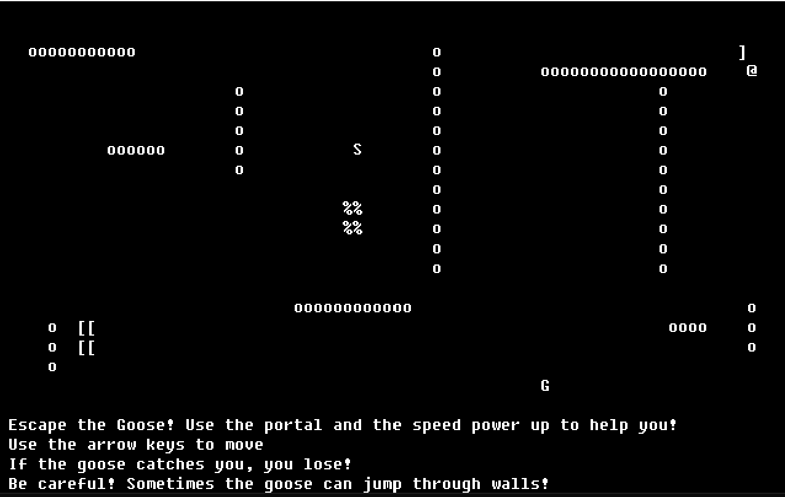

# C++ terminal video game

Video game created with C++ and BearLibTerminal.

The aim of the game is to run from the goose (G) that is chasing the player (@).
The player must make it to the finish (%) before the goose catches them.

## Main Features
- **Speed boost (S)**: The player will move at two time speed for the rest of the 
level.
- **Random spawn positions**: All the characters on the screen randomly spawn 
every level.
- **Portals**: The player can every a portal and exit from the exit portal on 
another side of the map.
- **Walls (o)**: The player must go around walls, note that the goose may 
occasionally fly over walls.
